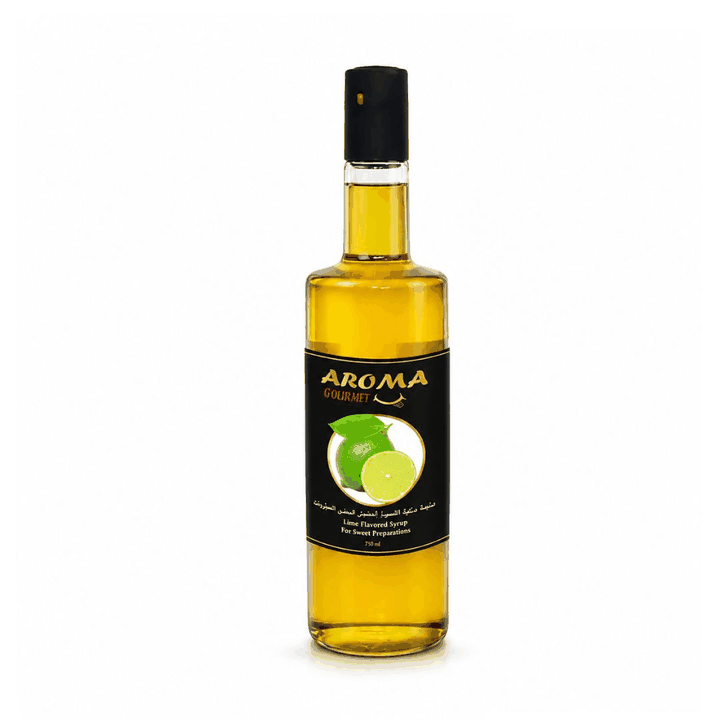

# 3D Photo Generator

Turns a flat 2D product photo into a "3D photo" by estimating a depth map and
re-rendering the scene from new camera viewpoints (depth-image-based
rendering). It is tuned for the common e-commerce case of a single object shot
on a bright, near-uniform background, but falls back to gradient/centre depth
cues for arbitrary images.

## Generated for `8683628545652.jpg`

Source image (AROMA Gourmet lime syrup):
`https://api-2.klix.ae/item/retrieve_file/6a41f967f1347348f4ba2342/photos/8683628545652.jpg`

| File | What it is |
| --- | --- |
| `3d_wiggle.gif` | Animated parallax "wigglegram" — the subject pops out of the background, **no glasses needed**. |
| `3d_anaglyph.jpg` | Red/cyan anaglyph — view with red-cyan 3D glasses. |
| `3d_stereo_pair.jpg` | Side-by-side left/right stereo pair (cross-eyed viewing). |
| `depth_map.png` | The estimated depth map (white = near, black = far). |



## How it works

1. **Depth estimation** (`estimate_depth`): the background colour is sampled
   from the image corners; everything that differs from it becomes the
   foreground mask. The mask is cleaned (open/close/fill, largest component),
   then a distance transform gives the subject a rounded, cylindrical "bulge"
   so it reads as a solid 3D object instead of a flat cut-out.
2. **View synthesis** (`synthesize_view`): pixels are displaced horizontally in
   proportion to their depth (forward warp + painter's algorithm), and the
   small disocclusion gaps are filled from neighbouring pixels.
3. **Outputs**: a stereo pair drives the anaglyph and side-by-side image, while
   a smooth sinusoidal camera sweep produces the wiggle GIF.

## Usage

```bash
pip install -r requirements.txt

# From a URL (re-creates the files in this folder):
python3 make_3d_photo.py "https://api-2.klix.ae/item/retrieve_file/6a41f967f1347348f4ba2342/photos/8683628545652.jpg"

# From a local file, into a chosen folder, with a stronger pop-out:
python3 make_3d_photo.py photo.jpg --out-dir out --max-shift 30 --frames 30 --fps 20
```

### Options

| Flag | Default | Description |
| --- | --- | --- |
| `--out-dir` | this folder | Where to write the outputs. |
| `--max-shift` | `22` | Maximum parallax displacement in pixels (more = stronger 3D). |
| `--frames` | `24` | Number of frames in the wiggle GIF. |
| `--fps` | `18` | Wiggle playback speed. |
